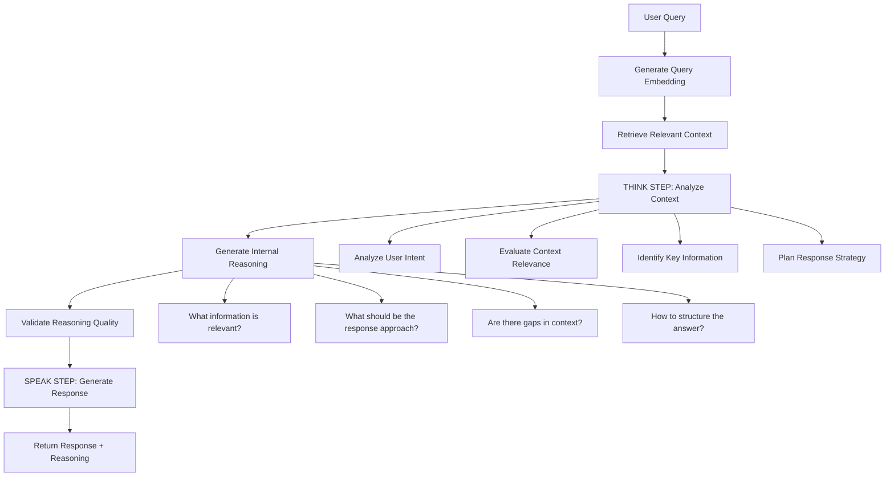

# RAG System Analysis and Agentic Design Plan

## Executive Summary

The RecruAI application has a well-structured RAG system architecture but contains critical implementation gaps that prevent it from functioning end-to-end. The current system needs completion of core functionality and enhancement with agentic "think before speak" capabilities for interview scenarios.

## Current RAG Implementation Status

### ✅ **Implemented Components:**

1. **Complete RAG Pipeline Architecture**

   - `RAGSupervisor` - Orchestrates workflow routing
   - `EmbedderTool` - Provider-agnostic embedding generation
   - `RetrieverTool` - Vector similarity search with pgvector
   - `IngestorTool` - Document processing and chunking
   - `GeneratorTool` - LLM-based answer generation

2. **API Infrastructure**

   - `/api/rag/query` - Main RAG query endpoint
   - `/api/rag/ingest/text` - Text ingestion
   - `/api/rag/ingest/file` - File ingestion
   - `/api/rag/health` - System health check
   - `/api/rag/stats` - Usage statistics

3. **Database Models**

   - `DocumentChunk` - Text chunks with metadata
   - `EmbeddingStore` - Vector embeddings storage

4. **Provider-Agnostic AI System**
   - Supports OpenAI, Groq, HuggingFace
   - Configurable via environment variables

### ⚠️ **Critical Implementation Gaps:**

1. **Mock Implementations Preventing Functionality**

   - `RAGSupervisor._execute_tool()` returns placeholder data
   - `RetrieverTool._get_chunk_data()` returns mock chunk data
   - PDF text extraction not implemented
   - No actual database operations for chunk storage/retrieval

2. **Missing Core RAG Operations**

   - Vector similarity search not fully implemented
   - No actual embedding storage in database
   - Chunk retrieval returns mock data instead of real queries

3. **No Agentic Capabilities**
   - Current system is standard retrieve → generate pipeline
   - No "thinking" step before response generation
   - No internal reasoning or validation

## 🧠 Agentic "Think Before Speak" Design

### **Proposed Enhanced Workflow:**



### **Key Agentic Components:**

1. **Thinking Module**

   - Analyzes retrieved context for relevance
   - Identifies gaps in information
   - Plans response strategy
   - Generates internal reasoning

2. **Validation Module**

   - Validates reasoning quality
   - Checks for consistency
   - Ensures response appropriateness

3. **Response Generation**
   - Uses validated reasoning to generate response
   - Maintains transparency by showing thinking process
   - Adapts tone based on interview context

## Implementation Plan

### Phase 1: Complete Core RAG Functionality

1. **Fix Mock Implementations**

   - Implement actual database operations in `RetrieverTool`
   - Complete vector similarity search with pgvector
   - Implement PDF text extraction
   - Connect `RAGSupervisor._execute_tool()` to real tools

2. **Database Integration**

   - Create proper database migrations for RAG tables
   - Implement chunk storage and retrieval
   - Set up vector indexes for similarity search

3. **Testing Infrastructure**
   - Create comprehensive test suite
   - Set up test data and embeddings
   - Implement integration tests

### Phase 2: Implement Agentic Capabilities

1. **Create Thinking Module**

   ```python
   class ThinkingModule:
       def analyze_context(self, query, context_chunks):
           # Analyze relevance and identify gaps
           pass

       def generate_reasoning(self, query, context, analysis):
           # Generate internal reasoning
           pass

       def validate_reasoning(self, reasoning):
           # Validate quality and consistency
           pass
   ```

2. **Enhanced Generator Tool**

   - Add thinking step before generation
   - Include reasoning in response
   - Implement validation checks

3. **New API Endpoints**
   - `/api/rag/agentic-query` - Enhanced query with thinking
   - `/api/rag/reasoning` - Get reasoning for previous query
   - `/api/rag/validate` - Validate reasoning quality

### Phase 3: Interview-Specific Enhancements

1. **Interview Context Integration**

   - Interview-specific thinking prompts
   - Candidate response analysis
   - Question strategy planning

2. **Real-time Reasoning Display**

   - Show thinking process in interview UI
   - Allow interviewer to review reasoning
   - Provide feedback mechanism

3. **Performance Optimization**
   - Caching for reasoning results
   - Async processing for thinking step
   - Optimized prompt engineering

## Testing Strategy

### Unit Tests

- Test each RAG component independently
- Mock external dependencies (AI providers)
- Validate data processing logic

### Integration Tests

- End-to-end RAG pipeline testing
- Database integration testing
- API endpoint testing

### Agentic Testing

- Validate reasoning quality
- Test thinking step accuracy
- Measure response improvement

### Performance Tests

- Latency measurements
- Memory usage monitoring
- Concurrent request handling

## Technical Requirements

### Backend Changes

1. Complete `RAGSupervisor._execute_tool()` implementation
2. Implement actual database operations in `RetrieverTool`
3. Add `ThinkingModule` class
4. Enhance `GeneratorTool` with agentic capabilities
5. Create new API endpoints for agentic features

### Frontend Changes

1. Add reasoning display component
2. Implement thinking indicator UI
3. Create reasoning review interface
4. Add performance metrics display

### Database Changes

1. Create tables for reasoning storage
2. Add indexes for performance
3. Implement vector similarity search
4. Add audit logging for reasoning

## Success Metrics

### Functional Metrics

- RAG system returns accurate, context-relevant answers
- Thinking step provides valuable insights
- Response quality improves with reasoning

### Performance Metrics

- Query response time < 3 seconds
- Thinking step adds < 1 second overhead
- 99% uptime for RAG services

### User Experience Metrics

- Users find reasoning helpful
- Interview quality improves
- System feels more intelligent and transparent

## Risks and Mitigations

### Technical Risks

- **Risk**: Increased latency from thinking step
- **Mitigation**: Optimize prompts, use caching, async processing

- **Risk**: Reasoning quality inconsistency
- **Mitigation**: Validation module, quality metrics, feedback loop

### Implementation Risks

- **Risk**: Complex integration with existing system
- **Mitigation**: Phased rollout, comprehensive testing, rollback plan

## Next Steps

1. **Immediate**: Fix core RAG functionality gaps
2. **Week 1-2**: Implement basic agentic thinking module
3. **Week 3-4**: Integrate with interview system
4. **Week 5-6**: Testing and optimization
5. **Week 7-8**: Deployment and monitoring

## Conclusion

The RAG system has solid architecture but needs completion of core functionality before adding agentic capabilities. The proposed "think before speak" enhancement will significantly improve interview quality by providing transparent reasoning and more thoughtful responses. The phased approach ensures minimal disruption while delivering maximum value.
